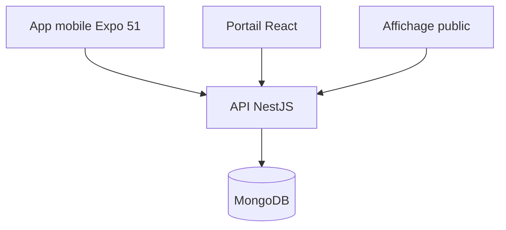

# Architecture — Project 3

Le JWT porte le rôle `ADMIN`, `AGENT`, `SUPERVISOR` ou `USER`. Les contrôleurs appliquent les gardes de rôles et l’API vérifie aussi la propriété des rendez-vous et tickets.

## Flux principal

1. L’usager consulte les disponibilités calculées selon horaires, jours fériés et capacité du créneau.
2. La réservation crée un numéro quotidien et un jeton QR unique.
3. Le QR n’est accepté que le jour prévu et une seule entrée de file est créée.
4. L’agent appelle, démarre, termine ou marque absent après le délai configurable.
5. Les statuts du rendez-vous et de la file restent synchronisés.
